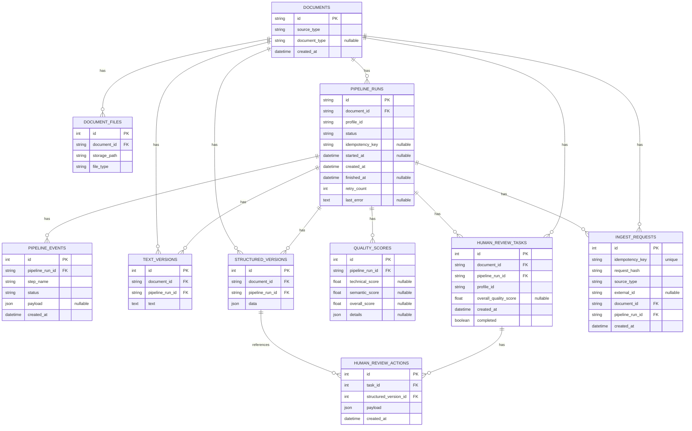
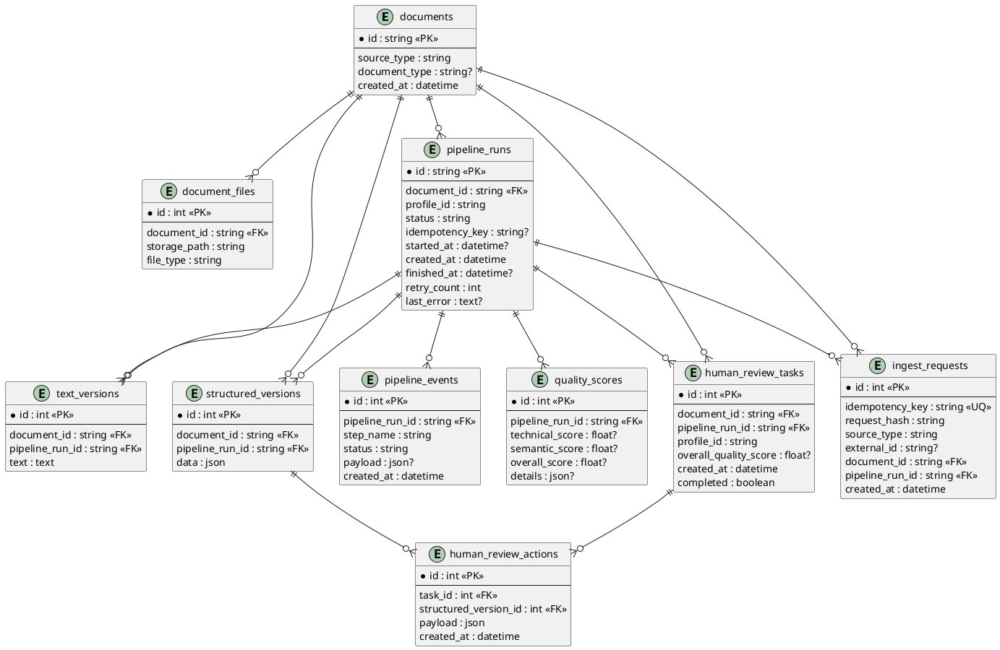

# Схема базы данных OCR-platform

Источник: `src/ocr_platform/storage/models.py` (SQLAlchemy ORM).

## ER-диаграмма (Mermaid)

## ER-диаграмма (PlantUML)

## Таблицы и поля

- `documents`
  - `id` (PK, `String`)
  - `source_type` (`String`, not null)
  - `document_type` (`String`, nullable)
  - `created_at` (`DateTime`, default `utcnow`)

- `document_files`
  - `id` (PK, `Integer`, autoincrement)
  - `document_id` (FK -> `documents.id`, not null)
  - `storage_path` (`String`, not null)
  - `file_type` (`String`, not null)

- `pipeline_runs`
  - `id` (PK, `String`)
  - `document_id` (FK -> `documents.id`, not null)
  - `profile_id` (`String`, not null)
  - `status` (`String`, default `"queued"`)
  - `idempotency_key` (`String`, nullable)
  - `started_at` (`DateTime`, nullable)
  - `created_at` (`DateTime`, default `utcnow`)
  - `finished_at` (`DateTime`, nullable)
  - `retry_count` (`Integer`, default `0`)
  - `last_error` (`Text`, nullable)

- `pipeline_events`
  - `id` (PK, `Integer`, autoincrement)
  - `pipeline_run_id` (FK -> `pipeline_runs.id`, not null)
  - `step_name` (`String`, not null)
  - `status` (`String`, not null)
  - `payload` (`JSON`, nullable)
  - `created_at` (`DateTime`, default `utcnow`)

- `text_versions`
  - `id` (PK, `Integer`, autoincrement)
  - `document_id` (FK -> `documents.id`, not null)
  - `pipeline_run_id` (FK -> `pipeline_runs.id`, not null)
  - `text` (`Text`, not null)

- `structured_versions`
  - `id` (PK, `Integer`, autoincrement)
  - `document_id` (FK -> `documents.id`, not null)
  - `pipeline_run_id` (FK -> `pipeline_runs.id`, not null)
  - `data` (`JSON`, not null)

- `quality_scores`
  - `id` (PK, `Integer`, autoincrement)
  - `pipeline_run_id` (FK -> `pipeline_runs.id`, not null)
  - `technical_score` (`Float`, nullable)
  - `semantic_score` (`Float`, nullable)
  - `overall_score` (`Float`, nullable)
  - `details` (`JSON`, nullable)

- `human_review_tasks`
  - `id` (PK, `Integer`, autoincrement)
  - `document_id` (FK -> `documents.id`, not null)
  - `pipeline_run_id` (FK -> `pipeline_runs.id`, not null)
  - `profile_id` (`String`, not null)
  - `overall_quality_score` (`Float`, nullable)
  - `created_at` (`DateTime`, default `utcnow`)
  - `completed` (`Boolean`, default `False`)

- `human_review_actions`
  - `id` (PK, `Integer`, autoincrement)
  - `task_id` (FK -> `human_review_tasks.id`, not null)
  - `structured_version_id` (FK -> `structured_versions.id`, not null)
  - `payload` (`JSON`, not null)
  - `created_at` (`DateTime`, default `utcnow`)

- `ingest_requests`
  - `id` (PK, `Integer`, autoincrement)
  - `idempotency_key` (`String`, unique, not null)
  - `request_hash` (`String`, not null)
  - `source_type` (`String`, not null)
  - `external_id` (`String`, nullable)
  - `document_id` (FK -> `documents.id`, not null)
  - `pipeline_run_id` (FK -> `pipeline_runs.id`, not null)
  - `created_at` (`DateTime`, default `utcnow`)

