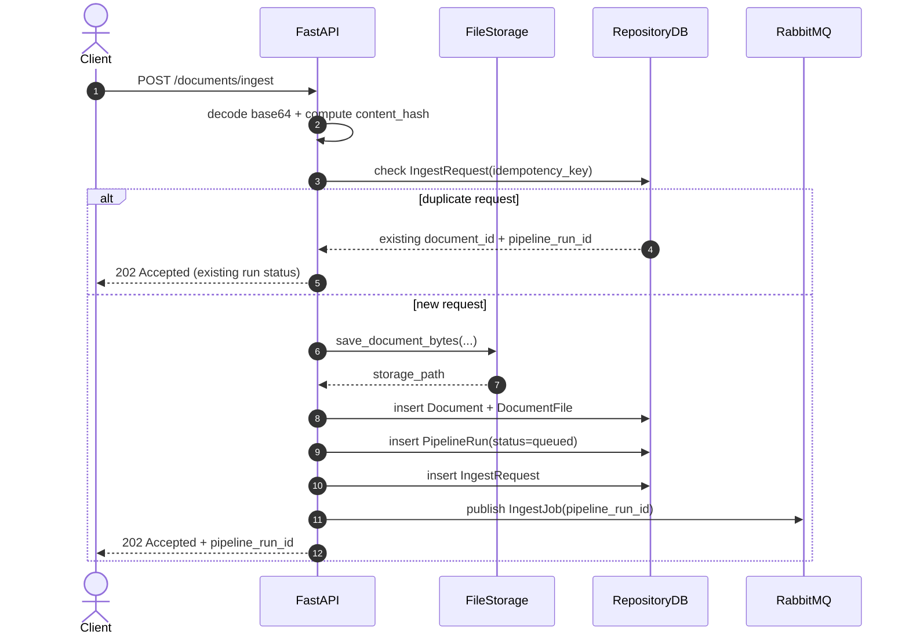
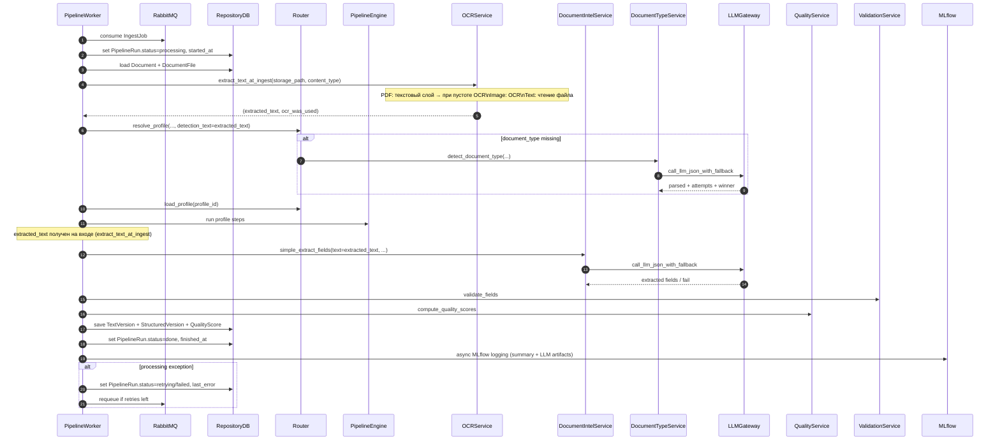
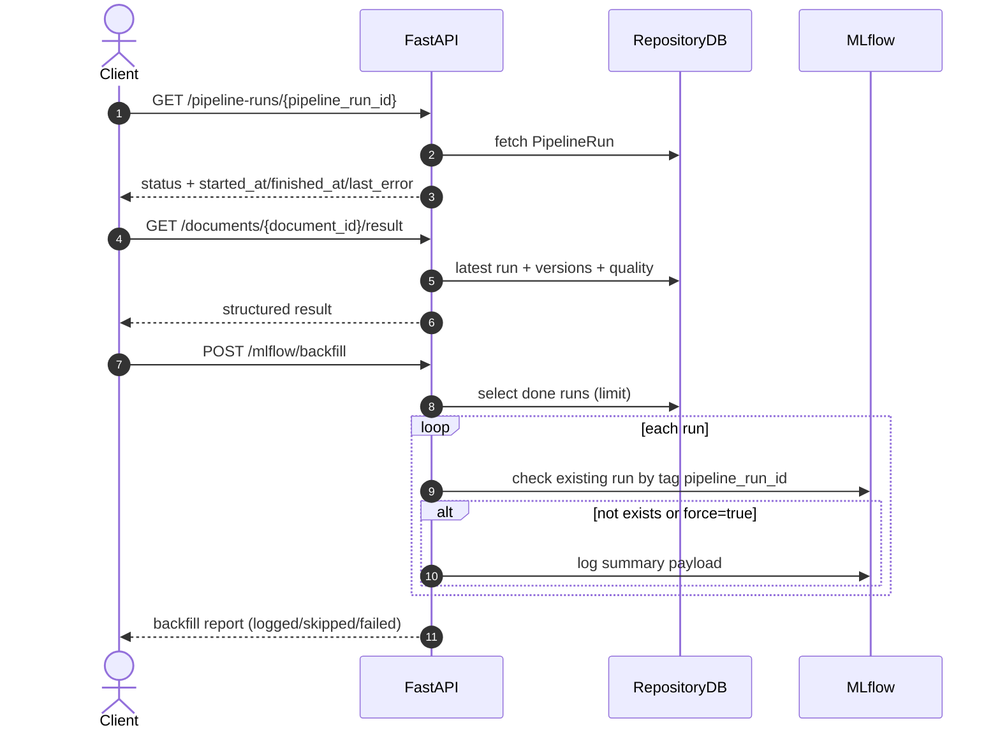
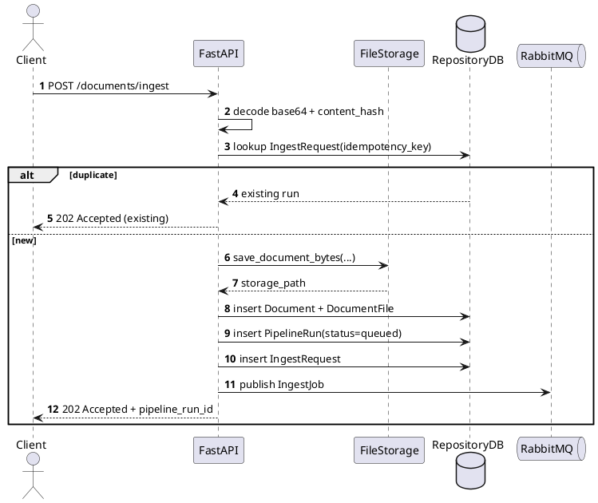
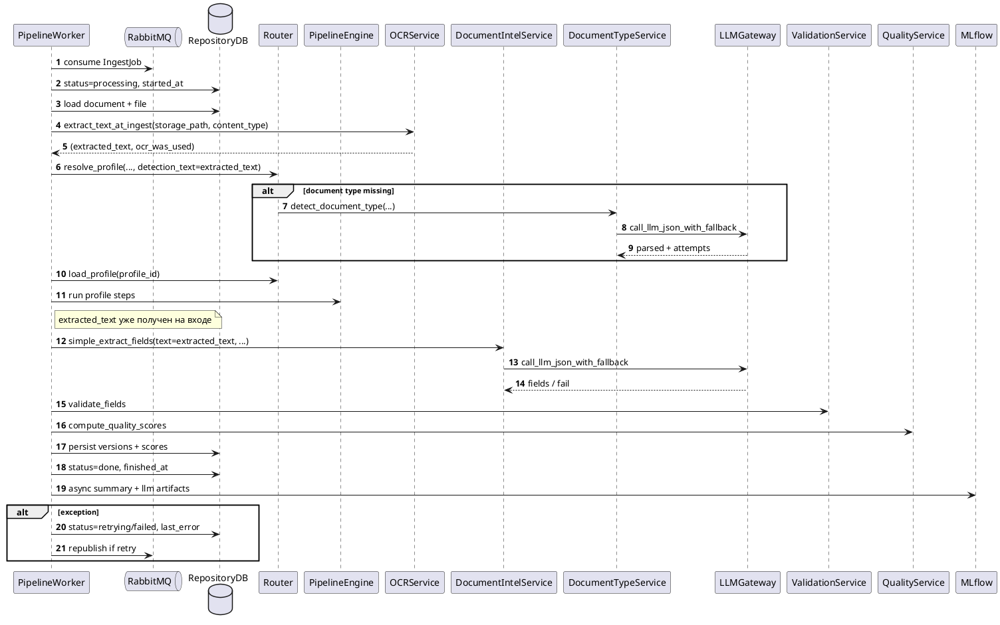
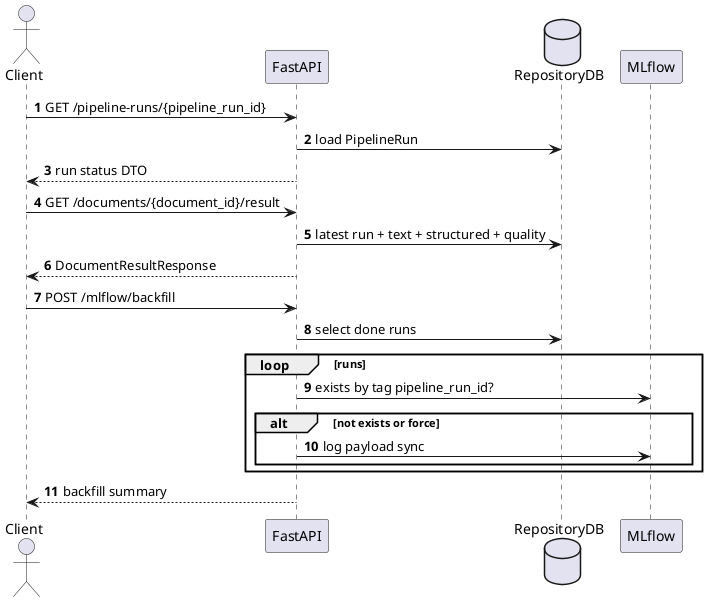

# Диаграммы последовательности обработки запросов

Актуально для асинхронной архитектуры:

- `POST /documents/ingest` только принимает, сохраняет и ставит в очередь (`202`).
- Worker обрабатывает pipeline отдельно.
- Статусы run: `queued -> processing -> done/failed/retrying`.

Основные модули: `api/main.py`, `workers/pipeline_worker.py`, `orchestration/run_processor.py`, `services/*`, `observability/mlflow_client.py`.

## Mermaid

### 1) Ingest + Queue: `POST /documents/ingest`

### 2) Worker pipeline execution

### 3) Status / Result / Backfill

## PlantUML

### 1) Ingest + Queue: `POST /documents/ingest`

### 2) Worker pipeline execution

### 3) Status / Result / Backfill

